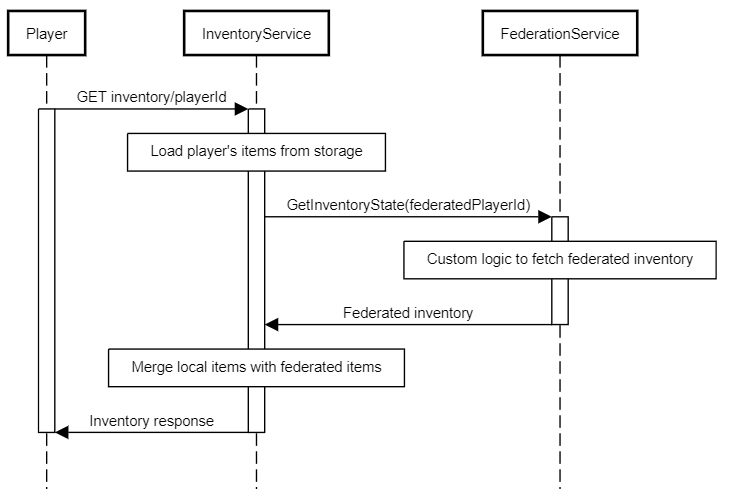
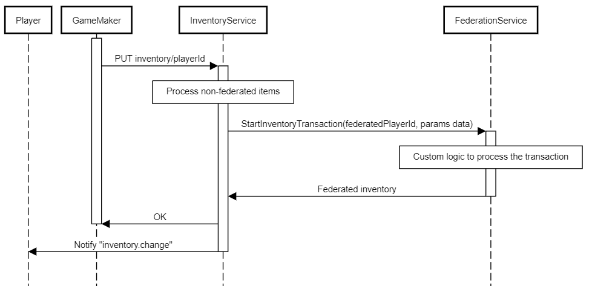

# Federated Inventory
Beamable supports custom inventory federation using managed [microservices](https://docs.beamable.com/docs/microservices-feature-overview). You can use this feature to extend the Inventory system with items that are externally provided and managed.
  
Some use cases:
- Crypto assets - use NFTs as inventory items and auto-mint new items
- Generative AI - add support for granting players AI generated items

**Requiremants:** 
- Federated Inventory depends on the implementation of [federated Authentication](https://github.com/beamable/FederatedAuthentication). That means that every player first needs to have a federated identity with the same microservice that federates inventory.
- Inventory items are content-driven. To enable federation, content item must be marked as federated to a specific microservice.

## Get inventory items flow with federation enabled

## Grant inventory items flow with federation enabled

## Code guide with examples
### 1. `IFederatedInventory<T>` interface
You should start with implementing the `IFederatedInventory<T>` interface in your microservice. Be aware that this inteface also implements `IFederatedLogin<T>` because federated authentication is a pre-requisite, as mentioned earlier. `T` must be your implementation of the `IThirdPartyCloudIdentity` - very simple interface that requires you to define a unique name/namespace for your federation. This enables you to have multiple federation implementations in a single microservice.